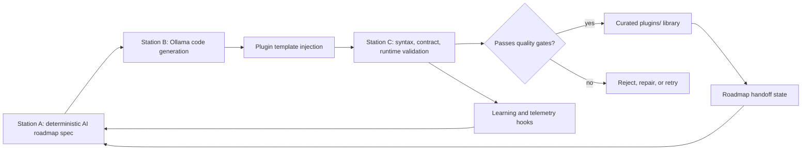

# Auto-Generated AI Capabilities

An autonomous AI capability factory that designs, generates, validates, repairs,
and publishes Python capability modules.

The stable part of this project is the production loop: deterministic capability
specs, Ollama-assisted generation, semantic validation, repair passes, and
GitHub publishing. The generated modules in `plugins/` are intentionally
dynamic and will change as the factory learns, expands, and tightens its quality
bar.

## Current Output

Generated capability modules land in `plugins/` after validation. This folder is
an output surface, not the permanent definition of the project. Each retained
module must import, invoke, return the expected envelope, expose a registered
capability profile, produce non-empty actions, and pass semantic-depth checks.

## Download

The current plugin is packaged as a GitHub-downloadable zip:

```text
dist/ai_prompt_refinement_engine-0.1.2.zip
```

Direct GitHub download URL after this repository is pushed:

```text
https://github.com/Ap3pp3rs94/Auto-Generated-Plugins/raw/main/dist/ai_prompt_refinement_engine-0.1.2.zip
```

The package contains:

- `ai_prompt_refinement_engine.py`
- `plugin.json`
- `README.md`
- `LICENSE`

Checksum:

```text
5f36085a373b6aeb68b8e06ffa18569af5ab078dd3989e91b8be080437ff039e  ai_prompt_refinement_engine-0.1.2.zip
```

Legacy modules created before the current AI capability roadmap guide were
removed. The tracked library should contain only capability modules generated
under the current rules:

- AI functionality first
- deterministic Python logic
- structured output for other agents/tools
- validation before retention
- no duplicate capabilities
- no random sales/data/demo modules
- useful user-facing progress and optional fun-mode fields

## Example

The first retained plugin is the `AI Prompt Refinement Engine`.

Spec summary:

```text
Name: AI Prompt Refinement Engine
Slug: ai_prompt_refinement_engine
Category: ai_prompting
Capability: enrichment
Goal: Analyze task instructions and produce clearer, safer, more testable prompts.
```

Generated output shape:

```json
{
  "summary": "AI Prompt Refinement Engine: Analyzing task instructions and producing clearer, safer, more testable prompts.",
  "primary_insights": ["No conversation history found."],
  "recommended_actions": [
    {
      "action": "Rewrite prompt",
      "description": "Use the task and objective to create a specific, testable instruction."
    }
  ],
  "scores": {
    "confidence": 0.8,
    "usefulness": 0.9
  },
  "progress_state": {
    "current_stage": "Analysis",
    "next_step": "Rewrite prompt",
    "blockers": [],
    "done_signals": []
  },
  "fun_mode": {
    "challenge_label": "Clear Path",
    "score_badge": "Ready to Run"
  }
}
```

The factory also runs a semantic-depth gate. A plugin must produce different
decision fields for different payload values; echoing the right schema with
stock advice is not enough.
Prompt-refinement plugins have an additional contract: they must identify vague
phrases, name missing constraints, and emit concrete rewritten prompts.

Full walkthrough:

```text
docs/GENERATED_PLUGIN_WALKTHROUGH.md
```

## Architecture



The factory is intentionally conservative. It would rather retry a plugin than
keep fallback logic after a timeout.

## Repository Layout

| Path | Purpose |
| --- | --- |
| `plugins/` | Curated generated plugin artifacts. |
| `spec_builder.py` | Canonical deterministic AI capability roadmap. |
| `factory_runner.py` | Production runner and station orchestration. |
| `station_b_generator.py` | Lightweight Station B fallback for this sidecar repo. |
| `station_c_validator.py` | Structural and runtime validation helpers. |
| `plugin_template.py` | Plugin source template. |
| `plugin_spec.py` | Serializable plugin specification model. |
| `profiles/` | Capability-specific deterministic profiles used to repair or override shallow generated bodies. |
| `learning/` | Dataset and learning hooks. |
| `ops/` | Side-project operations templates. |
| `archive/legacy/` | Older station experiments kept out of the main path. |
| `docs/` | Walkthroughs and portfolio-facing explanations. |

Canonical current path:

```text
spec_builder.py -> factory_runner.py -> Station B -> plugin_template.py -> station_c_validator.py -> plugins/
```

When this repository lives at `/home/peppera091/francis/factory`, generated
plugins land in:

```text
/home/peppera091/francis/factory/plugins
\\wsl$\Ubuntu\home\peppera091\francis\factory\plugins
```

## Quick Start

Clone and set up a local environment:

```bash
git clone https://github.com/Ap3pp3rs94/Auto-Generated-Plugins.git
cd Auto-Generated-Plugins
python -m venv .venv
source .venv/bin/activate
python -m pip install -r requirements.txt
```

Run the tests:

```bash
python -m unittest discover -s tests
```

Inspect the resolved factory config without generating a plugin:

```bash
python -m factory_runner --print-config --once
```

Run one factory pass with Ollama:

```bash
ollama serve
ollama pull llama3.1:8b
python -m factory_runner --once
```

The runner defaults are tuned for local Ollama:

```text
model: llama3.1:8b
temperature: 0.25
max tokens: 4096
context length: 8192
timeout: 900 seconds
sleep: 15 seconds
```

## Running Inside Francis

This repository can also live as the `factory/` sidecar inside the larger
Francis project. In that mode the full Francis Station B runtime, registry,
Station D evaluation hooks, and Station E learning hooks can be used.

From the parent Francis project:

```bash
python -m factory.factory_runner --once
```

Generated plugins still land in the sidecar repository's own `factory/plugins/`
directory, not the parent Francis `plugins/` directory.

The same runner also supports batch or continuous side-project operation:

```bash
python -m factory.factory_runner --max-plugins 3
python -m factory.factory_runner --loop --sleep-seconds 15
```

## Configuration

The runner accepts CLI flags and `FRANCIS_FACTORY_*` environment variables.

Useful flags:

```text
--once
--max-plugins 3
--loop
--model llama3.1:8b
--max-tokens 4096
--context-length 8192
--timeout-seconds 900
--sleep-seconds 15
--github-remote origin
--github-branch main
--no-github-publish
--print-config
```

By default, every validated plugin is committed and pushed to `origin/main`.
The autonomous commit is limited to that plugin file, so runtime state and
unrelated local edits are not swept into the publish.

See `production.env.example` for service-friendly environment settings.

## Service Template

A systemd user-service template is included for side-project operation:

```text
ops/francis-factory.service
```

Example install:

```bash
mkdir -p ~/.config/systemd/user
cp ops/francis-factory.service ~/.config/systemd/user/
systemctl --user daemon-reload
systemctl --user enable francis-factory.service
systemctl --user start francis-factory.service
```

View logs:

```bash
journalctl --user -u francis-factory.service -f
```

## Quality Gates

Generated capability modules are kept only when they satisfy the current guide:

- produced from the deterministic AI roadmap
- unique slug and distinct capability
- backed by a capability-specific profile when the roadmap has one
- real Station B output, or a registered deterministic profile replacing timeout fallback output
- Python syntax compiles
- capability module contract validates
- runtime smoke check passes
- semantic-depth check passes across contrasting payloads
- output includes structured AI-agent-friendly fields
- user-facing extras remain secondary to the core recommendation

## Roadmap

The factory is designed to grow into complementary AI capability areas:

- prompt refinement
- agent task planning
- tool selection
- memory compression
- context-window optimization
- output quality scoring
- hallucination risk auditing
- retrieval query expansion
- multi-agent handoff planning
- prompt test generation
- workflow debugging
- response comparison
- instruction conflict detection
- structured prompt building
- capability routing
- evaluation rubric generation

Each plugin should advance the roadmap instead of renaming or recreating a
previous plugin.

## Topics

Suggested GitHub topics:

```text
autonomous-agents
code-generation
ollama
plugin-system
llm-tools
ai-agents
python
```

## License

MIT. See `LICENSE`.
