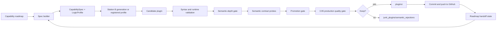

# Auto-Generated AI Capabilities

Auto-Generated AI Capabilities is a continuously running Python factory for
building, validating, publishing, and auditing autonomous AI capability modules.

The repository has two surfaces:

- `plugins/` is the public library of generated AI capabilities.
- the factory code is the production system that decides what is allowed into
  that library.

The library is intentionally dynamic. New capabilities are generated and pushed
as the factory expands, while weak or duplicate candidates are rejected before
they become installable.

## What This Produces

Each retained plugin is a standalone Python module with a stable async entrypoint:

```python
result = await invoke(user_id="demo", payload={...})
```

The response envelope is consistent across the library:

```json
{
  "status": "succeeded",
  "output": {
    "summary": "...",
    "primary_insights": [],
    "recommended_actions": [],
    "scores": {},
    "details": {},
    "progress_state": {},
    "user_experience": {},
    "fun_mode": {}
  },
  "error": "",
  "meta": {}
}
```

The capabilities are for AI consumption first: planning, prompt quality,
retrieval, tool use, handoffs, memory, evaluation, safety, debugging,
verification, and release readiness. Their target use cases are intentionally
broad. The factory may create AI-facing capabilities for agriculture,
manufacturing, healthcare, education, legal, finance, media, field service,
personal workflows, or other domains as long as the module turns payload data
into structured, deterministic assistance an AI system can use.

## Naming And Expansion

Continuous expansion uses short numbered capability names. Category and profile
families may repeat, and target domains can range widely, but each new module
must carry a distinct AI-use-case scenario instead of packing every domain,
mode, and surface into the slug.

Current naming standard:

```text
ai_<capability_family>_<number>
```

Example:

```text
ai_capability_overlap_checker_000833
```

Older verbose names remain supported for already-published modules, but new
generation should keep the slug readable and put target/context variation in the
spec, use cases, tags, and output behavior.

## Production Standard

A plugin is kept only if it passes the current production gate:

- imports cleanly and compiles as Python
- exposes the expected async `invoke` interface
- returns the normalized result envelope
- uses deterministic logic with no hidden network, file, or tool side effects
- reacts to payload values instead of returning stock advice
- passes semantic-depth checks across contrasting payloads
- satisfies any declared `CapabilitySpec`, `LogicProfile`, and semantic contract
- passes capability-specific promotion gates before canonical registration
- scores at least `0.95` on the production quality gate
- passes A+ certification for missing-input behavior, non-dict payload warning
  preservation, rich diagnostics, profile-specific detail keys, and semantic
  contrast across probes
- does not duplicate an existing canonical capability
- has a distinct use-case seed when it reuses an existing category or profile family
- replaces a canonical plugin only when the candidate is measurably better
- is committed and pushed to GitHub only after validation

Sub-threshold candidates are discarded. Rejected capabilities are remembered so
the factory does not keep retrying the same weak idea under the same factory
knowledge.

## Architecture



Capability-specific profiles are used when the model output is shallow,
duplicative, or timed out. The goal is not to produce code quickly; the goal is
to produce capability modules that actually do what their names claim.

## Capability Operating Layer

The `factory_os/` package is the governance layer for capabilities. It defines
typed capability specs, logic profile aliases, semantic probes, promotion
decisions, and canonical capability records. This prevents a polished shell from
being promoted when the behavior is routed to the wrong profile or only returns
generic guidance.

Example: overlap checkers normalize historical aliases such as
`continuous_capability_overlap_checker_profile` and
`plugin_duplicate_detector_profile` to the canonical
`capability_overlap_checker_profile`. A candidate that returns backlog fields
instead of `duplicate_risks`, `comparison_targets`, `max_similarity`, and
`merge_or_reject_decision` is sent to repair or rejected before publishing.

## Repository Layout

| Path | Purpose |
| --- | --- |
| `plugins/` | Curated generated AI capability modules. |
| `factory_runner.py` | Main production runner, validation flow, publishing, and quality gates. |
| `spec_builder.py` | Deterministic capability roadmap and expansion logic. |
| `profiles/` | Registered deterministic capability profiles for high-signal plugin bodies. |
| `factory_os/` | Capability specs, logic profile registry, semantic contracts, promotion gate, and canonical registry. |
| `quality_runner.py` | Audits existing plugins and repairs or flags weak modules. |
| `station_b_generator.py` | Station B generation path for model-assisted plugin bodies. |
| `station_c_validator.py` | Structural and runtime validation helpers. |
| `plugin_template.py` | Shared plugin source template. |
| `plugin_spec.py` | Serializable plugin specification model. |
| `docs/` | Walkthroughs and deeper notes. |
| `dist/` | Optional release-package output for current A+ artifacts; stale packages are removed. |
| `packages/` | Optional package staging area for a selected current capability. |
| `archive/legacy/` | Older experiments kept out of the active production path. |

## Quick Start

```bash
git clone https://github.com/Ap3pp3rs94/Auto-Generated-Plugins.git
cd Auto-Generated-Plugins
python -m venv .venv
source .venv/bin/activate
python -m pip install -r requirements.txt
```

Run the test suite:

```bash
python -m unittest discover -s tests
```

Audit the current library without modifying files:

```bash
python -m quality_runner --once --no-repair --no-github-publish
```

Count the currently retained plugins:

```bash
find plugins -maxdepth 1 -type f -name '*.py' | wc -l
```

## Running the Factory

The factory uses local Ollama for model-assisted generation when needed.

```bash
ollama serve
ollama pull llama3.1:8b
python -m factory_runner --once
```

Useful runner flags:

```text
--once
--loop
--max-plugins 3
--model llama3.1:8b
--max-tokens 4096
--context-length 8192
--timeout-seconds 900
--sleep-seconds 15
--github-remote origin
--github-branch main
--no-github-publish
--print-config
```

Default local generation settings are intentionally patient:

```text
model: llama3.1:8b
temperature: 0.25
max tokens: 4096
context length: 8192
timeout: 900 seconds
```

## Running Inside Francis

This repository can run as the `factory/` sidecar inside the larger Francis
project. In that mode, run from the Francis parent:

```bash
python -m factory.factory_runner --loop
```

Generated modules land in this repository's own `factory/plugins/` directory.
They are not written into the parent Francis application plugin folder.

## GitHub Publishing

When GitHub publishing is enabled, the runner commits and pushes each validated
plugin to `origin/main`. The publish step is intentionally narrow: it commits the
generated plugin file for that unit of work, not unrelated local changes.

The factory also supports quality cleanup commits, such as removing plugins that
fall below the current production threshold.

## Release Packages

The source of truth is the promoted capability library in `plugins/`. Release
packages are generated only from a current A+ capability and should not outlive
the plugin they package. Stale package zips and package directories are removed
instead of kept as historical examples.

Package artifacts, when present, should include:

- the selected plugin module
- `plugin.json`
- `README.md`
- `LICENSE`
- checksum metadata for the exact archive

## Example Capability

Retained capabilities are expected to map their names to real deterministic
behavior. For a prompt-refinement capability, that means behavior such as:

- identifying vague phrases
- naming missing constraints
- producing concrete rewritten prompts
- scoring specificity and risk
- returning structured next actions for another agent or UI

For an overlap-checking capability, the equivalent standard is duplicate-risk
records, comparison targets, max similarity, and an explicit
`merge_or_reject_decision`. Metadata relabeling is not accepted as capability
behavior.

## Quality Workflow

Use the quality runner for periodic review:

```bash
python -m quality_runner --once --no-repair --no-github-publish
```

Use repair mode only when you want the runner to replace weak plugins with
registered profile output:

```bash
python -m quality_runner --once
```

The active bar is strict by design. Passing means the module is structurally
valid, invokes successfully, has meaningful output fields, passes semantic depth,
and clears the `0.95` production quality threshold.

## Service Template

A systemd user-service template is included:

```text
ops/francis-factory.service
```

Install example:

```bash
mkdir -p ~/.config/systemd/user
cp ops/francis-factory.service ~/.config/systemd/user/
systemctl --user daemon-reload
systemctl --user enable francis-factory.service
systemctl --user start francis-factory.service
```

View logs:

```bash
journalctl --user -u francis-factory.service -f
```

## Suggested GitHub Topics

```text
autonomous-agents
code-generation
ollama
plugin-system
llm-tools
ai-agents
python
```

## License

MIT. See `LICENSE`.
